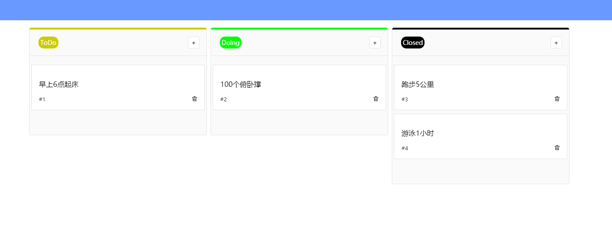
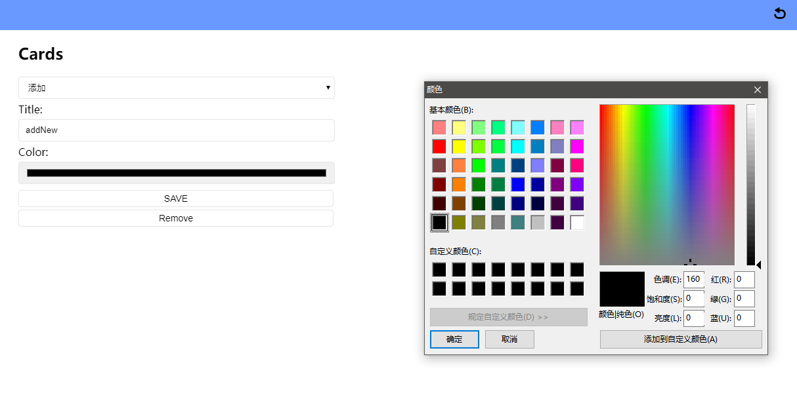

# taskboard

这是一个使用vue以及electron实现的任务看板小工具，外观仿照了gitlab的taskboard。对于整理工作中的任务项很方便！

#### 截图

主界面



配置界面



#### 构建

``` bash
# install dependencies
npm install

# serve with hot reload at localhost:9080
npm run dev

# build electron application for production
npm run build

# build electron application for win32
npm run build:win32

# lint all JS/Vue component files in `src/`
npm run lint

```
